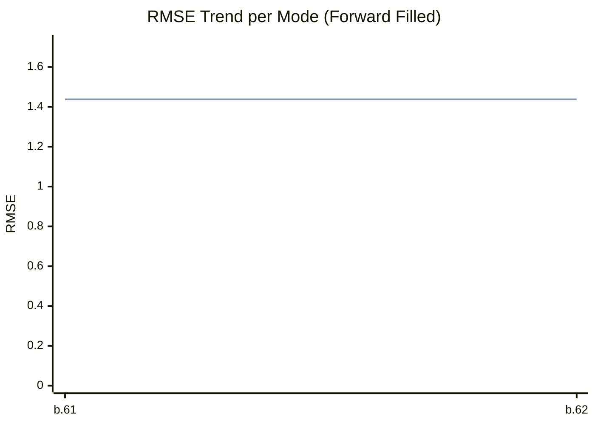

# Path Tracer Benchmark Dashboard

## Latest Run Summary
| Mode | Final RMSE |
|---|---|
| **MT** | 1.4381 |
| **ST** | 1.4381 |


## Historical Performance (Per Mode)


## Latest Render Gallery
| MT | ST |
| :---: | :---: |
|  |  |

## Convergence Comparison
```mermaid
xychart-beta
    title "Convergence Rate (Current Run)"
    x-axis ["1", "2"]
    y-axis "RMSE" 0 --> 2.2307
    line [2.0279, 1.4381]
    line [2.0279, 1.4381]

```

---
*Last updated: 2026-02-18T13:09:46.086690*
