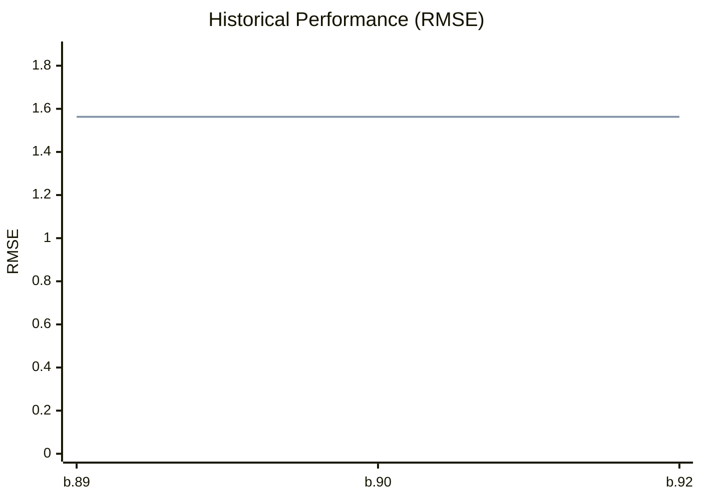

# Path Tracer Benchmark Dashboard

## Summary
| Mode | Final RMSE | Total Time | Steps |
|---|---|---|---|
| **MT** | 1.5629 | 1.00s | 2 |
| **ST** | 1.5629 | 3.10s | 2 |

## Historical Trend

> **Legend:** Line 1: **MT** | Line 2: **ST**

## Latest Render Gallery
| MT | ST |
| :---: | :---: |
|  |  |

## Convergence Comparison

---
*Last updated: 2026-02-18T16:55:10.512570 (Commit: 7936fd67)*
