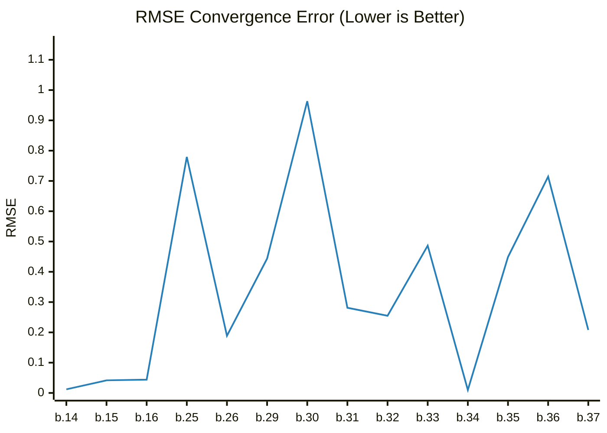

# Benchmark Dashboard

This dashboard tracks the image quality performance (RMSE) of the renderer over time.

| Metric | Latest Value |
|--------|--------------|
| **Version** | `0.1.0-build.37` |
| **Date** | 2026-02-16T19:41:50.458062 |
| **RMSE** | **0.2079** |

## Performance Trend

---
*Last updated by GitHub Actions on 2026-02-16T19:41:50.458062.*
