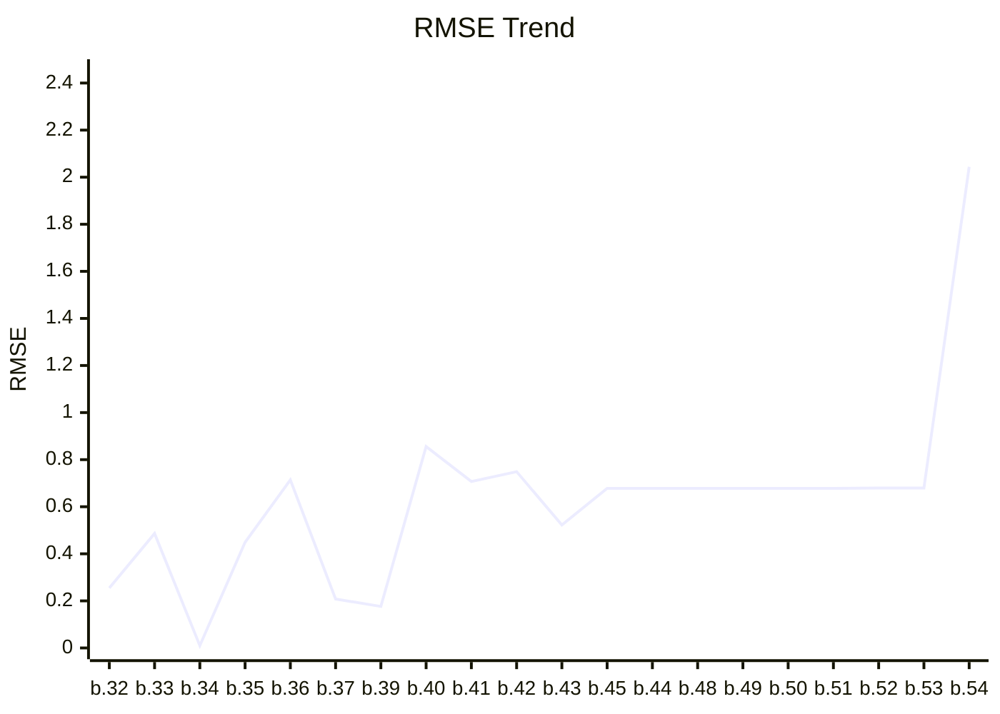

# Benchmark Dashboard

This dashboard tracks the image quality performance (RMSE) of the renderer.

| Metric | Latest Value |
|--------|--------------|
| **Version** | `0.1.0-build.54` |
| **Date** | 2026-02-18T02:33:39.821868 |
| **Final RMSE** | **2.0441** |

## Performance Trend


## Latest Render


### Convergence Progress
```mermaid
---
config:
    theme: base
    themeVariables:
        xyChart:
            plotColorPalette: "#e67e22"
---
xychart-beta
    title "Convergence Rate"
    x-axis ["1", "2", "3", "4", "5", "6", "7", "8", "9", "10"]
    y-axis "RMSE" 0 --> 3.2241
    line [2.931, 2.4755, 2.3084, 2.2178, 2.1615, 2.1229, 2.0947, 2.074, 2.0581, 2.0441]
```

> This graph shows how the error decreased across 10 rendering steps.

---
*Last updated by GitHub Actions on 2026-02-18T02:33:39.821868.*
