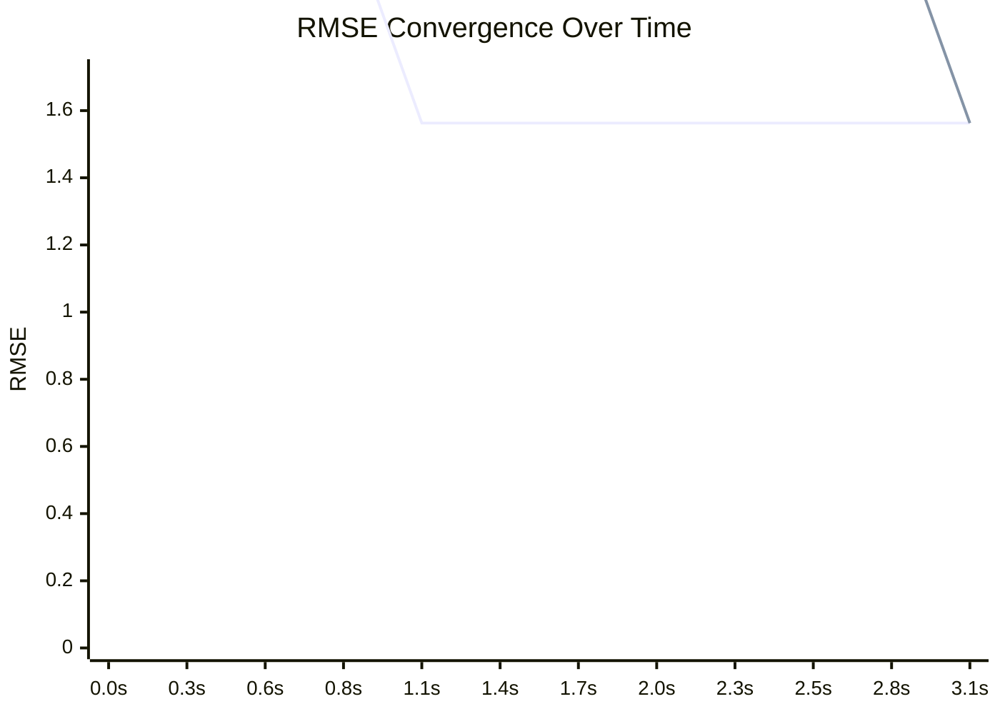

# Path Tracer Benchmark Dashboard

## Summary
| Mode | Final RMSE | Total Time | Steps |
|---|---|---|---|
| **MT** | 1.5629 | 1.00s | 2 |
| **ST** | 1.5629 | 3.11s | 2 |


## Historical Trend
```mermaid
xychart-beta
    title "Historical Performance (RMSE)"
    x-axis ["b.89"]
    y-axis "RMSE" 0 --> 1.8755
    line [1.5629]
    line [1.5629]
```
> **Legend:** Line 1: **MT** | Line 2: **ST**

## Latest Render Gallery
| MT | ST |
| :---: | :---: |
|  |  |

## Convergence Comparison

> **Legend:** Line 1: **MT** | Line 2: **ST**

---
*Last updated: 2026-02-18T16:32:20.273812 (Commit: a94db8f4)*
