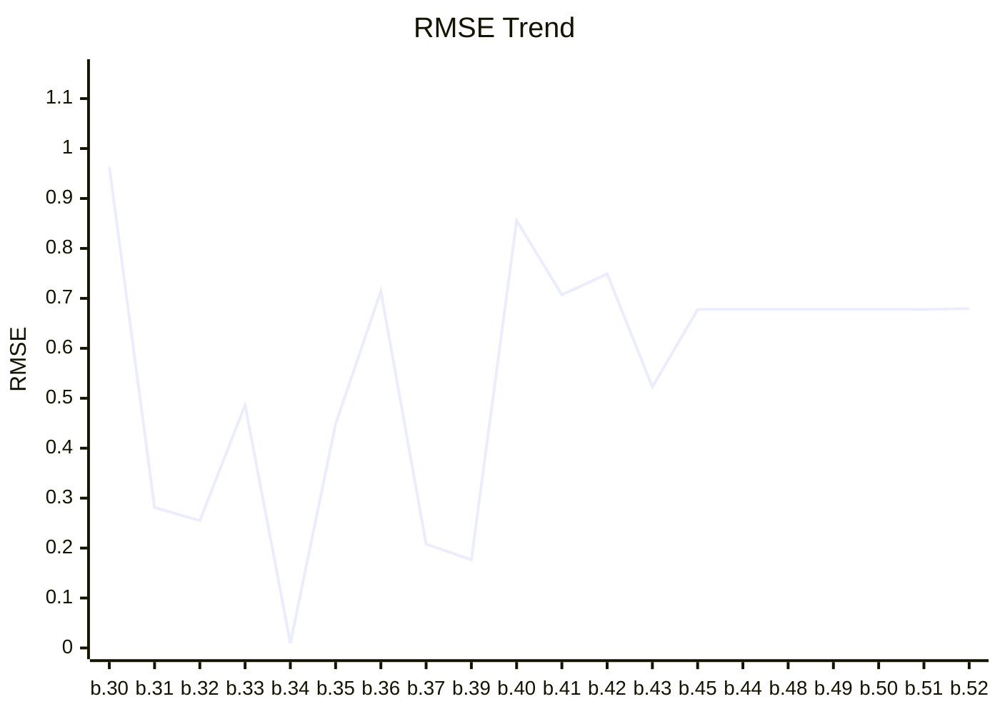
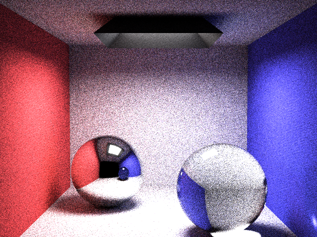

# Benchmark Dashboard

This dashboard tracks the image quality performance (RMSE) of the renderer.

| Metric | Latest Value |
|--------|--------------|
| **Version** | `0.1.0-build.52` |
| **Date** | 2026-02-17T22:03:36.882991 |
| **Final RMSE** | **0.6796** |

## Performance Trend


## Latest Render


### Convergence Progress
```mermaid
---
config:
    theme: base
    themeVariables:
        xyChart:
            plotColorPalette: "#e67e22"
---
xychart-beta
    title "Convergence Rate"
    x-axis ["1", "2", "3", "4", "5", "6", "7", "8", "9", "10"]
    y-axis "RMSE" 0 --> 2.2307
    line [2.0279, 1.4381, 1.185, 1.0336, 0.9306, 0.8561, 0.7964, 0.7495, 0.7116, 0.6796]
```

> This graph shows how the error decreased across 10 rendering steps.

---
*Last updated by GitHub Actions on 2026-02-17T22:03:36.882991.*
