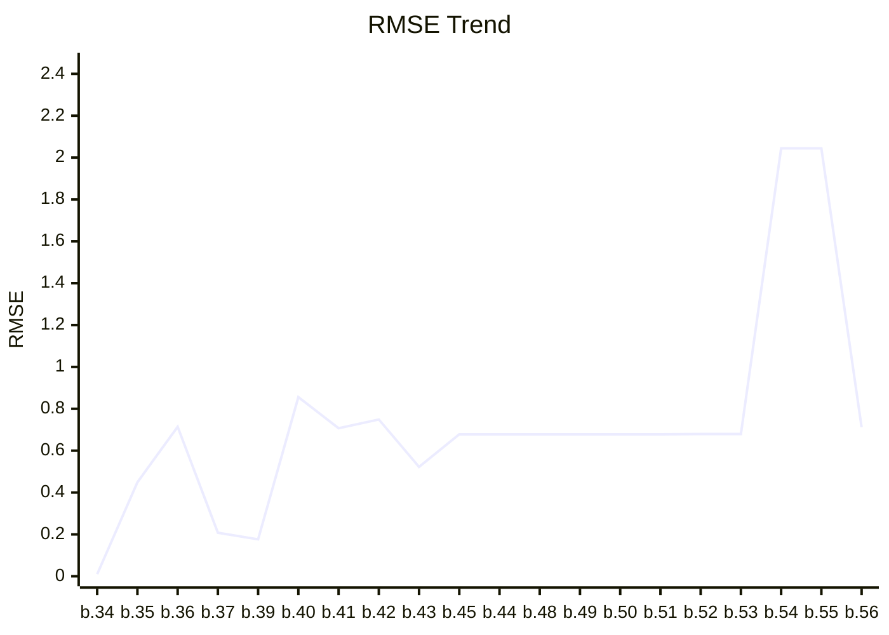
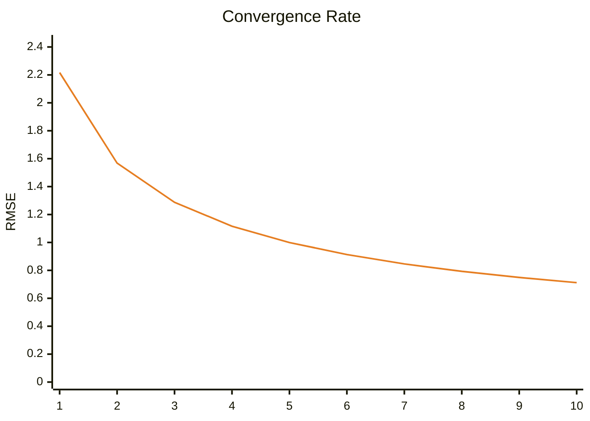

# Benchmark Dashboard

This dashboard tracks the image quality performance (RMSE) of the renderer.

| Metric | Latest Value |
|--------|--------------|
| **Version** | `0.1.0-build.56` |
| **Date** | 2026-02-18T02:42:27.405258 |
| **Final RMSE** | **0.7121** |

## Performance Trend

## Latest Render

### Convergence Progress

> This graph shows how the error decreased across 10 rendering steps.

---
*Last updated by GitHub Actions on 2026-02-18T02:42:27.405258.*
