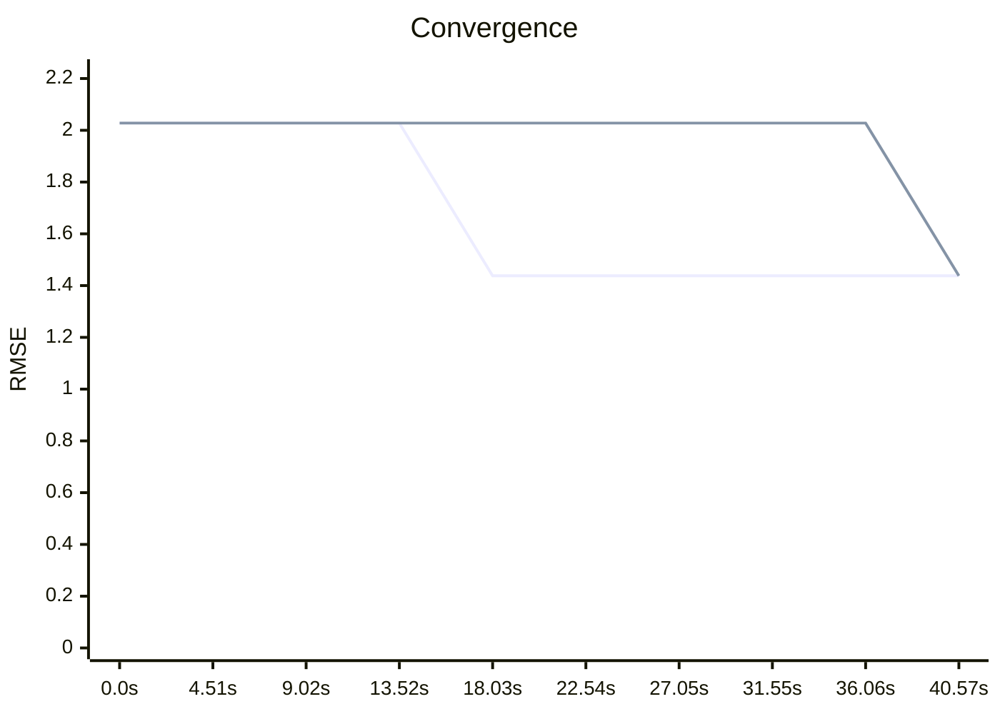

# Benchmark
## Summary
| Mode | Final RMSE | Total Time | Steps |
|---|---|---|---|
| **MT** | 1.4381 | 13.56s | 2 |
| **ST** | 1.4381 | 40.57s | 2 |

## Trend
```mermaid
xychart-beta
    title "Trend"
    x-axis ["b.66"]
    y-axis "RMSE" 0 --> 1.7257
    line [1.4381]
    line [1.4381]
```
## Gallery
| MT | ST |
| :---: | :---: |
|  |  |
## Convergence
