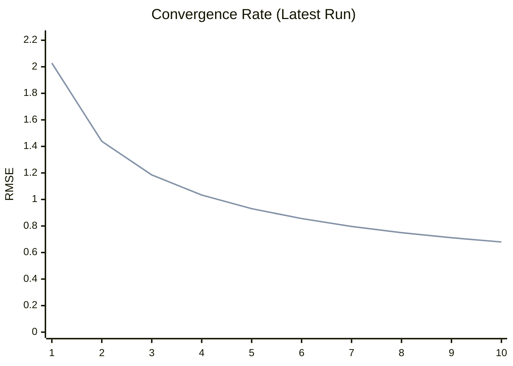

# Path Tracer Benchmark Dashboard

## Latest Run Summary
| Mode | Final RMSE |
|---|---|
| **ST** | 0.6796 |
| **MT** | 0.6796 |


## Historical Performance (Per Mode)
```mermaid
xychart-beta
    title "RMSE Trend per Mode"
    x-axis ["0.1.0", "b.59"]
    y-axis "RMSE" 0 --> 2.4529
    line [0.012064] 
    line [0.041607] 
    line [0.043946] 
    line [0.7793] 
    line [0.1888] 
    line [0.4436] 
    line [0.9634] 
    line [0.2812] 
    line [0.2549] 
    line [0.4864] 
    line [0.0098] 
    line [0.4489] 
    line [0.7142] 
    line [0.2079] 
    line [0.1763] 
    line [0.8557] 
    line [0.7071] 
    line [0.749] 
    line [0.5226] 
    line [0.677836] 
    line [0.677984] 
    line [0.678] 
    line [0.678] 
    line [0.678] 
    line [0.6778] 
    line [0.6796] 
    line [0.6796] 
    line [2.0441] 
    line [2.0441] 
    line [0.7121] 
    line [0.7121] 
    line [0.6796] 
    line [0.6796] 

```

## Latest Render Gallery
| ST | MT |
| :---: | :---: |
|  |  |

## Convergence Comparison


---
*Last updated: 2026-02-18T12:38:25.919914*
