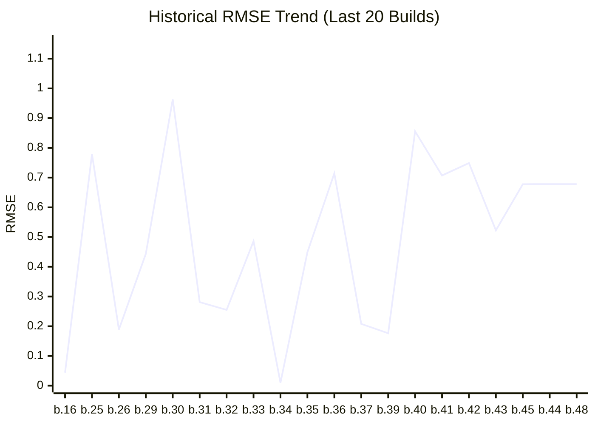

# Benchmark Dashboard

This dashboard tracks the image quality performance (RMSE) of the renderer.

| Metric | Latest Value |
|--------|--------------|
| **Version** | `0.1.0-build.48` |
| **Date** | 2026-02-17T16:27:48.090595 |
| **Final RMSE** | **0.678** |

## Performance Trend


## Latest Render


### Convergence Progress
```mermaid
---
config:
    theme: base
    themeVariables:
        xyChart:
            plotColorPalette: "#e67e22"
---
xychart-beta
    title "Convergence Rate (10 Total Steps)"
    x-axis ['1', '2', '3', '4', '5', '6', '7', '8', '9', '10']
    y-axis "RMSE" 0 --> 2.2378
    line [2.0344, 1.4459, 1.1882, 1.0361, 0.929, 0.8525, 0.7951, 0.7476, 0.7095, 0.678]
```

> This graph shows how the error decreased across 10 rendering steps.

---
*Last updated by GitHub Actions on 2026-02-17T16:27:48.090595.*
