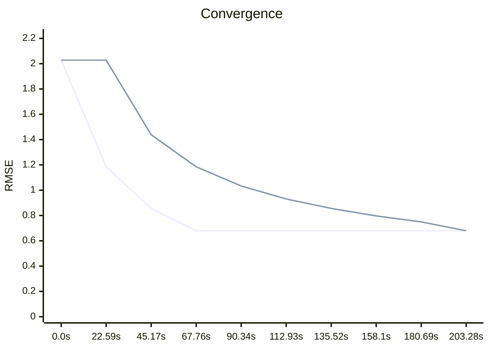

# Benchmark
## Summary
| Mode | Final RMSE | Total Time | Steps |
|---|---|---|---|
| **MT** | 0.6796 | 67.37s | 10 |
| **ST** | 0.6796 | 203.28s | 10 |

## Trend
```mermaid
xychart-beta
    title "Trend"
    x-axis ["b.66", "b.67"]
    y-axis "RMSE" 0 --> 1.7257
    line [1.4381, 0.6796]
    line [1.4381, 0.6796]
```
## Gallery
| MT | ST |
| :---: | :---: |
|  |  |
## Convergence
