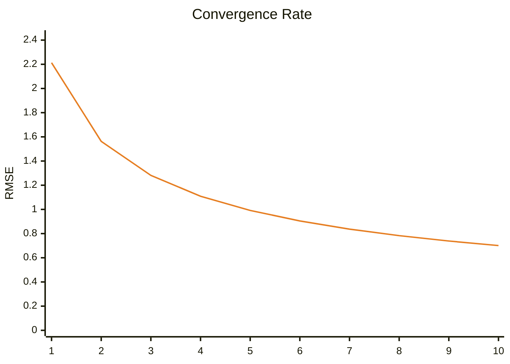

# Benchmark Dashboard

This dashboard tracks the image quality performance (RMSE) of the renderer.

| Metric | Latest Value |
|--------|--------------|
| **Version** | `0.1.0-build.65` |
| **Date** | 2026-02-18T13:35:49.633351 |
| **Final RMSE** | **540f1519** |

## Performance Trend
```mermaid
xychart-beta
    title "RMSE Trend"
    x-axis ["b.61", "b.61", "b.62", "b.62", "b.65"]
    y-axis "RMSE" 0 --> 1.7257
    line [1.4381, 1.4381, 1.4381, 1.4381]
```

## Latest Render


### Convergence Progress


> This graph shows how the error decreased across 10 rendering steps.

---
*Last updated by GitHub Actions on 2026-02-18T13:35:49.633351.*
