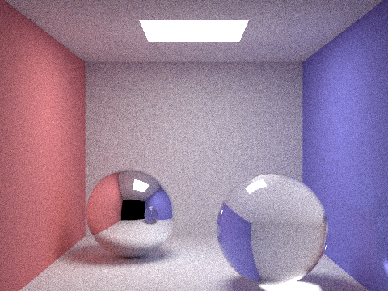
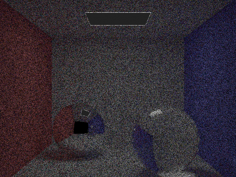
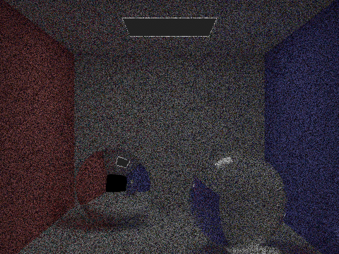
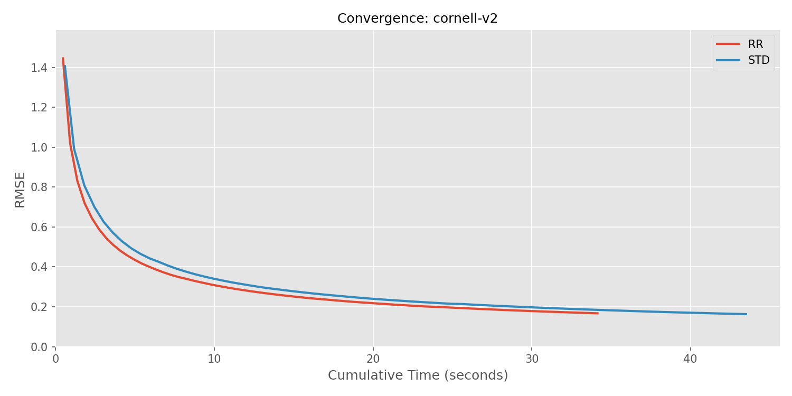
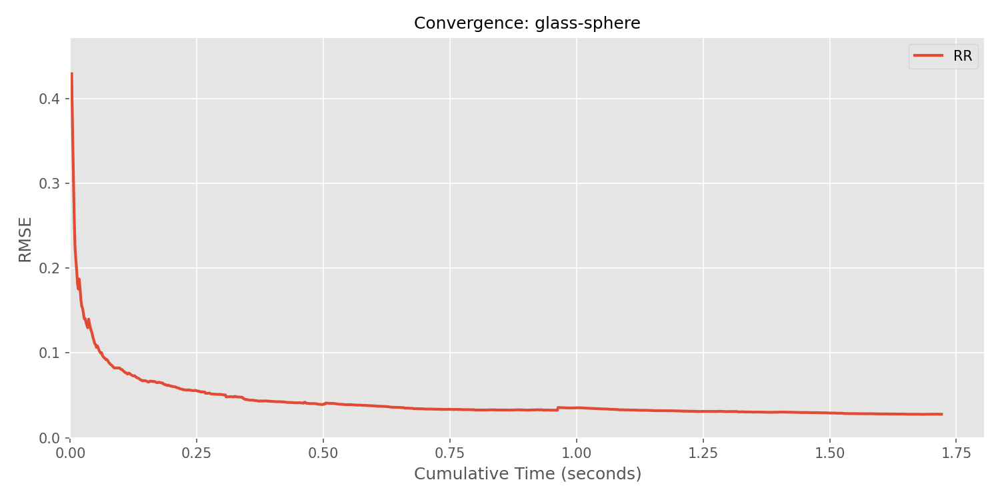

# Path Tracer Benchmark Dashboard

## Summary Results
| Scene | Variant | RelMSE Score | Render Time | Iterations | Date |
|---|---|---|---|---|---|
| caustics | **rr** | 0.58730 | 6.55s | 200 | 2026-03-04 19:43 |
| caustics | **std** | 0.61090 | 6.57s | 200 | 2026-03-04 19:43 |
| cornell | **std** | 0.36090 | 29.77s | 60 | 2026-03-04 17:15 |
| cornell | **rr** | 0.40520 | 28.18s | 60 | 2026-03-04 17:15 |
| cornell-v2 | **rr** | 0.16720 | 34.21s | 150 | 2026-03-04 19:43 |
| cornell-v2 | **std** | 0.16310 | 43.24s | 150 | 2026-03-04 19:43 |
| glass-sphere | **rr** | 0.06020 | 1.80s | 1000 | 2026-03-04 19:43 |

## RelMSE Trend

## Runtime Trend

## Render Gallery & Convergence
### Scene: caustics

| Type | rr | std | Reference |
| :---: | :---: | :---: | :---: |
| **Render** |  |  |  |
| **Diff** |  |  | |

### Convergence: caustics

---
### Scene: cornell

| Type | rr | std | Reference |
| :---: | :---: | :---: | :---: |
| **Render** |  |  |  |
| **Diff** |  |  | |

### Convergence: cornell

---
### Scene: cornell-v2

| Type | rr | std | Reference |
| :---: | :---: | :---: | :---: |
| **Render** |  |  |  |
| **Diff** |  |  | |

### Convergence: cornell-v2

---
### Scene: glass-sphere

| Type | rr | Reference |
| :---: | :---: | :---: |
| **Render** |  |  |
| **Diff** |  | |

### Convergence: glass-sphere

---

---
*last updated: 2026-03-04 19:43 (commit: e6d0560a)*
