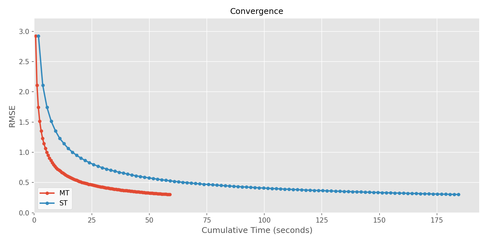

# Path Tracer Benchmark Dashboard

## Summary
| Mode | Final RMSE | Total Time | Steps |
|---|---|---|---|
| **MT** | 0.3017 | 58.95s | 100 |
| **ST** | 0.3017 | 184.39s | 100 |

## Historical Trend

## Latest Render Gallery
| Reference | MT | ST |
| :---: | :---: | :---: |
|  |  |  |
| |  |  |

## Convergence Comparison

---
*Last updated: 2026-02-23T15:16:59.281897 (Commit: 5df035d7)*
