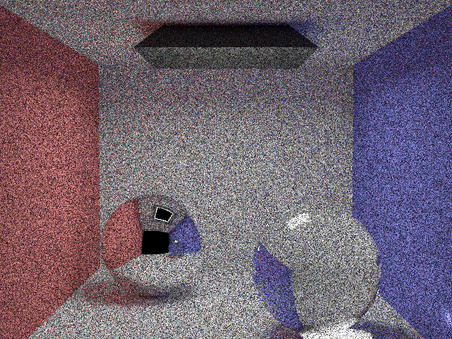
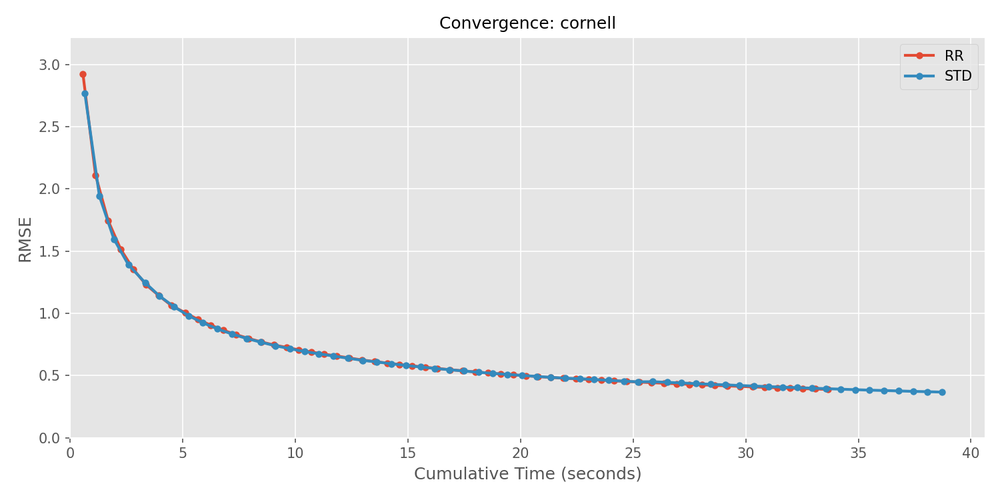

# Path Tracer Benchmark Dashboard

## Summary Results
| Scene | Variant | RelMSE Score | Render Time | Iterations | Date |
|---|---|---|---|---|---|
| cornell | **std** | 1.07240 | 7.46s | 10 | 2026-02-25 17:40 |

## RelMSE Trend

## Time Taken Trend

## Render Gallery & Convergence
### Scene: cornell

| Type | std | Reference |
| :---: | :---: | :---: |
| **Render** |  |  |
| **Diff** |  | |

### Convergence: cornell

---

---
*last updated: 2026-02-25 17:40 (commit: 26158de2)*
