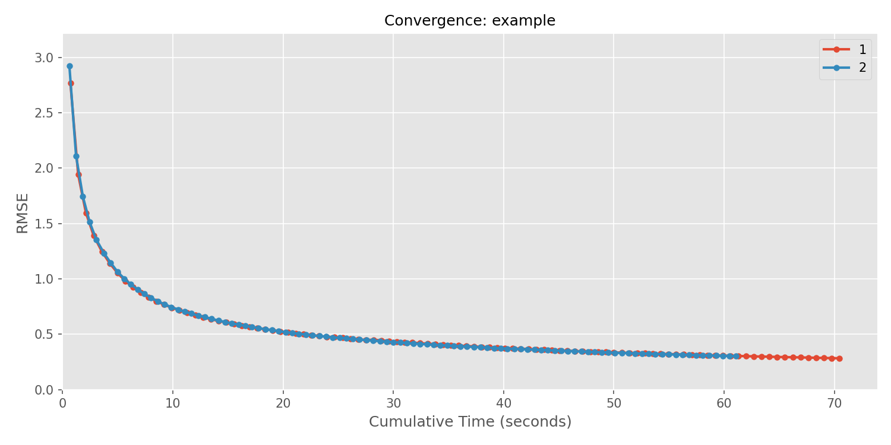

# Path Tracer Benchmark Dashboard

## Summary Results
| Scene | Variant | RelMSE Score | Render Time | Iterations | Date |
|---|---|---|---|---|---|
| example | **3** | nan | 38.72s | 200 | 2026-02-24 23:52 |
| example | **1** | 0.28260 | 70.40s | 100 | 2026-02-24 23:52 |
| example | **2** | 0.30170 | 60.63s | 100 | 2026-02-24 23:52 |
| example | **4** | nan | 38.52s | 200 | 2026-02-24 23:52 |

## RelMSE Trend

## Time Taken Trend

## Render Gallery & Convergence
### Scene: example

| Type | 1 | 2 | 3 | 4 |
| :---: | :---: | :---: | :---: | :---: |
| **Render** |  |  |  |  |
| **Diff** |  |  |  |  |

### Convergence: example

---

---
*last updated: 2026-02-24 23:52 (commit: ebcdffb7)*
