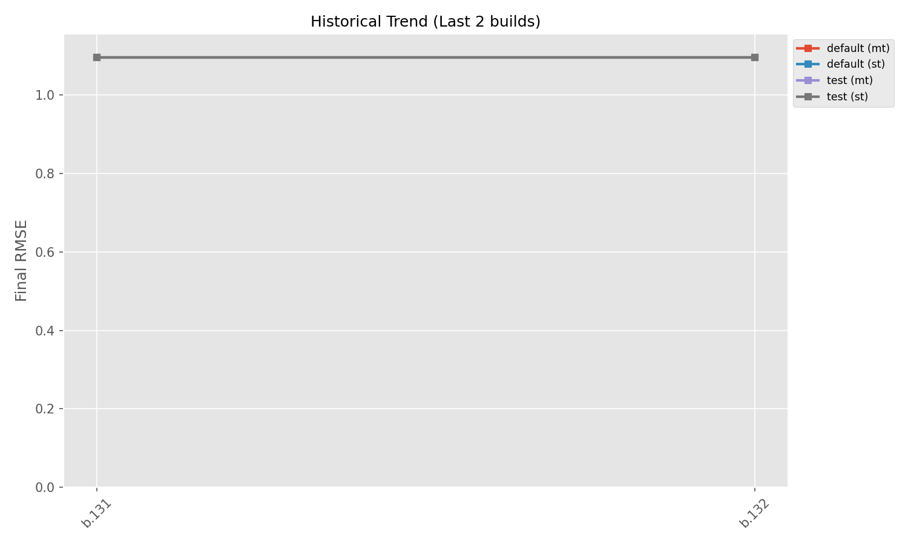
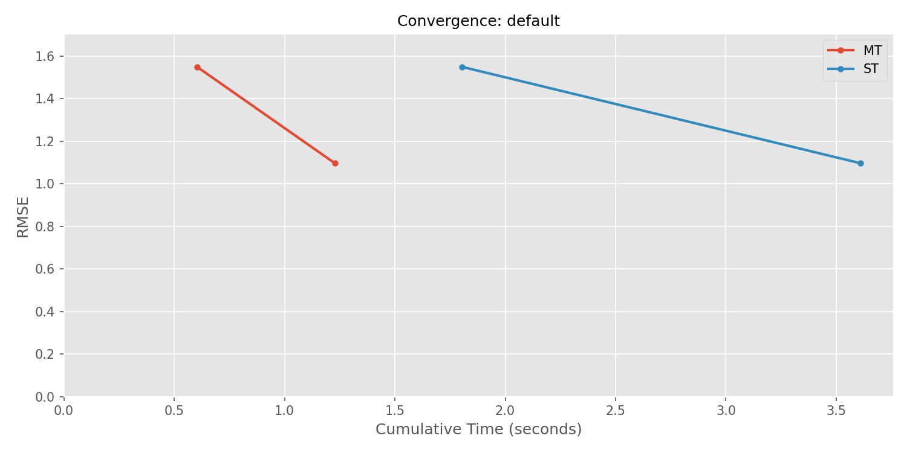
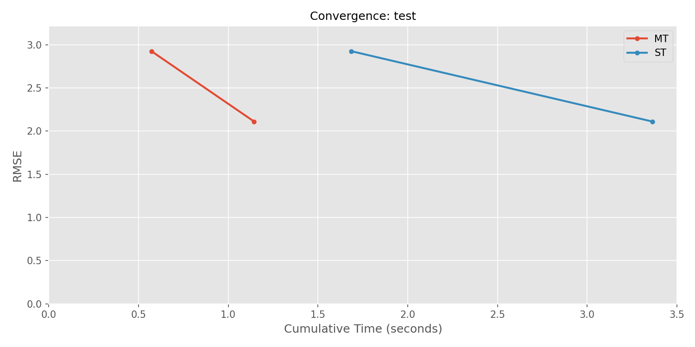

# Path Tracer Benchmark Dashboard

## Summary Results
| Scene | Variant | Final RMSE | Date |
|---|---|---|---|
| default | **st** | 1.09610 | 2026-02-24T00:09:31.999120 |
| default | **mt** | 1.09610 | 2026-02-24T00:09:31.999120 |
| test | **mt** | 1.09610 | 2026-02-24T00:09:31.999120 |
| test | **st** | 1.09610 | 2026-02-24T00:09:31.999120 |

## Historical Trend

## Render Gallery & Convergence
### Scene: default

| Type | mt | st |
| :---: | :---: | :---: |
| **Render** |  |  |
| **Diff** |  |  |

**Convergence for default:**

---
### Scene: test

| Type | mt | st |
| :---: | :---: | :---: |
| **Render** |  |  |
| **Diff** |  |  |

**Convergence for test:**

---

---
*last updated: 2026-02-24T00:09:31.999120 (commit: 3b04f599)*
