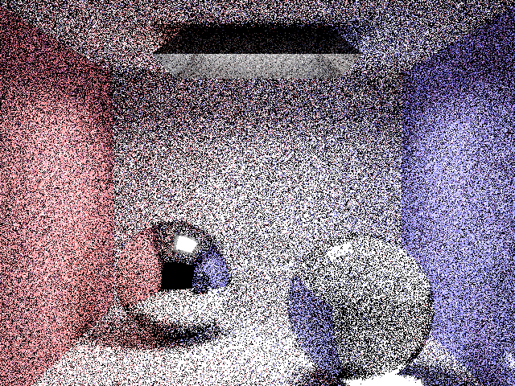
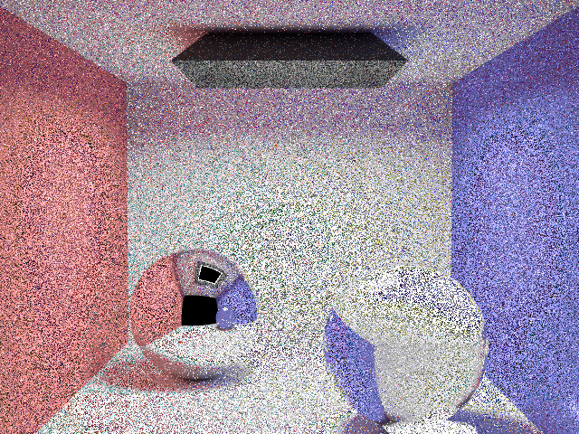
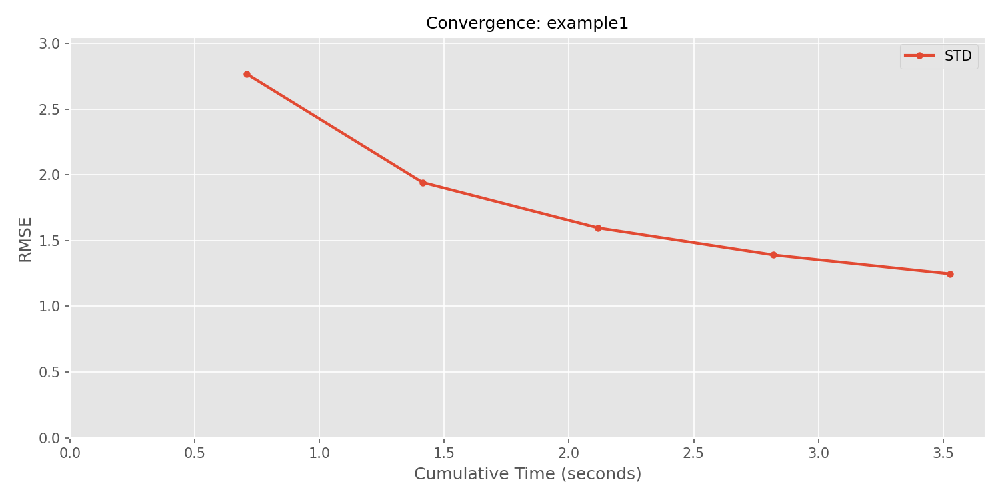
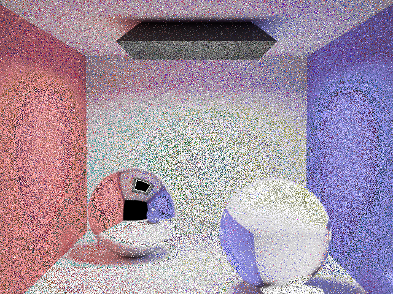

# Path Tracer Benchmark Dashboard

## Summary Results
| Scene | Variant | RelMSE Score | Render Time | Iterations | Date |
|---|---|---|---|---|---|
| example1 | **std** | 1.24670 | 3.53s | 5 | 2026-02-25 13:00 |
| example2 | **rr** | 1.35390 | 3.11s | 5 | 2026-02-25 13:00 |

## RelMSE Trend

## Time Taken Trend

## Render Gallery & Convergence
### Scene: example1

| Type | std | Reference |
| :---: | :---: | :---: |
| **Render** |  |  |
| **Diff** |  | |

### Convergence: example1

---
### Scene: example2

| Type | rr | Reference |
| :---: | :---: | :---: |
| **Render** |  |  |
| **Diff** |  | |

### Convergence: example2

---

---
*last updated: 2026-02-25 13:00 (commit: 30288ae6)*
