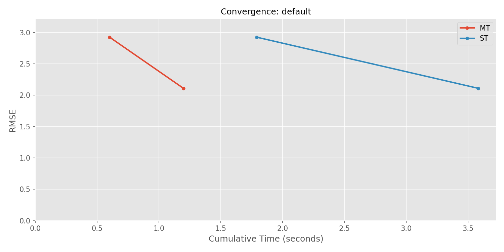
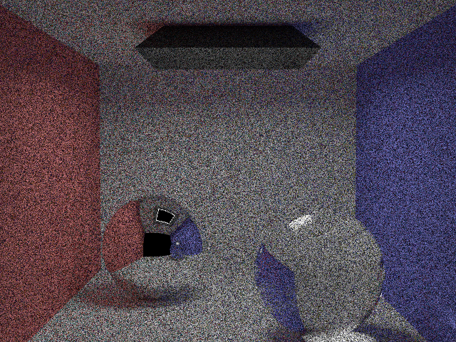
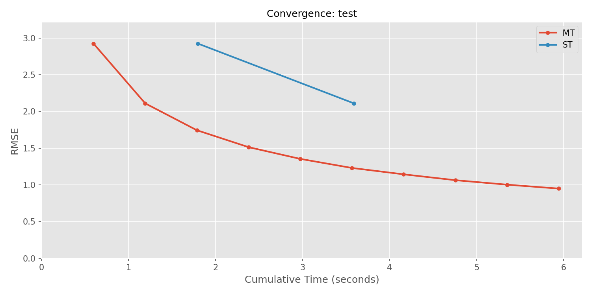

# Path Tracer Benchmark Dashboard

## Summary Results
| Scene | Variant | Final RMSE | Date |
|---|---|---|---|
| default | **st** | 2.11070 | 3.58s | 2026-02-24T19:25:36.644051 |
| default | **mt** | 2.11070 | 1.22s | 2026-02-24T19:25:36.644051 |
| test | **mt** | 2.11070 | 1.32s | 2026-02-24T19:25:36.644051 |
| test | **st** | 2.11070 | 3.58s | 2026-02-24T19:25:36.644051 |

## RMSE Trend

## Time Taken Trend

## Render Gallery & Convergence
### Scene: default

| Type | mt | st |
| :---: | :---: | :---: |
| **Render** |  |  |
| **Diff** |  |  |

### Convergence: default

---
### Scene: test

| Type | mt | st |
| :---: | :---: | :---: |
| **Render** |  |  |
| **Diff** |  |  |

### Convergence: test

---

---
*last updated: 2026-02-24T19:25:36.644051 (commit: 8c46e3f1)*
