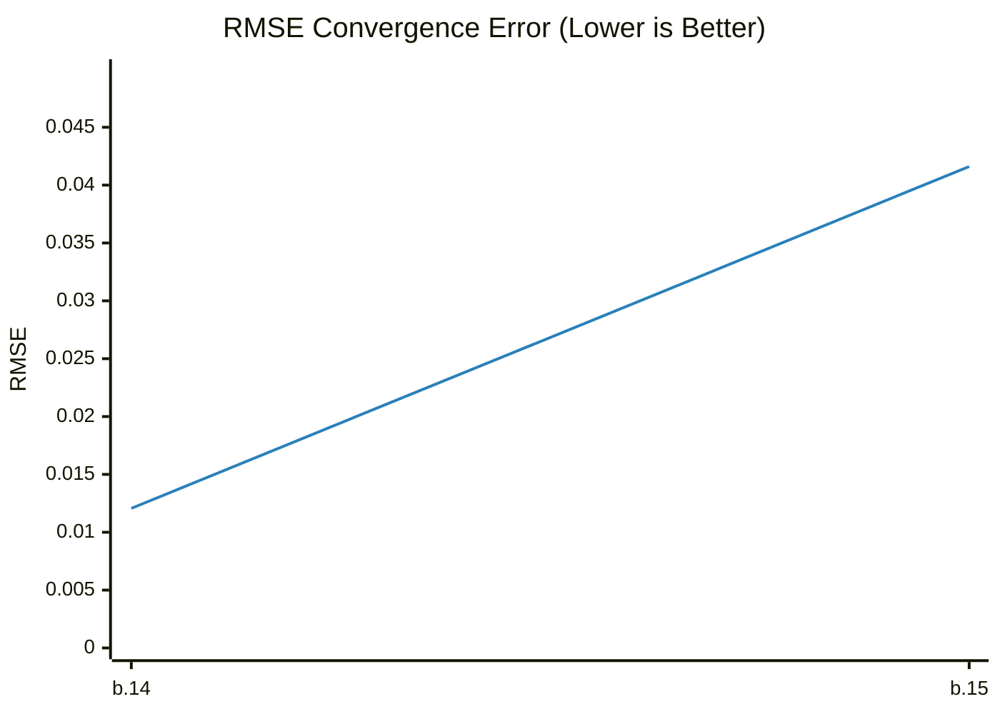

# 🚀 Benchmark Dashboard

This dashboard tracks the image quality performance (RMSE) of the renderer over time.

| Metric | Latest Value |
|--------|--------------|
| **Version** | `0.1.0-build.15` |
| **Date** | 2026-02-12 22:39:42 |
| **RMSE** | **0.041607** |

## 📈 Performance Trend

---
*Last updated by GitHub Actions on 2026-02-12 22:39:42.*
